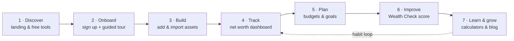
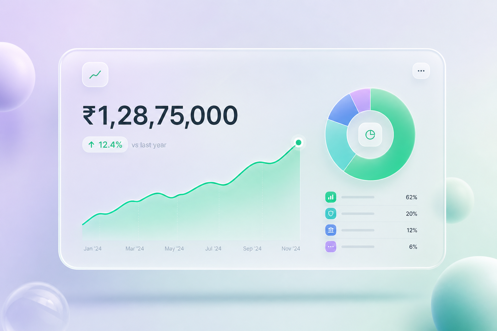
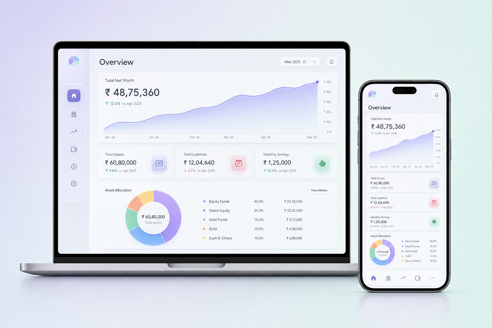
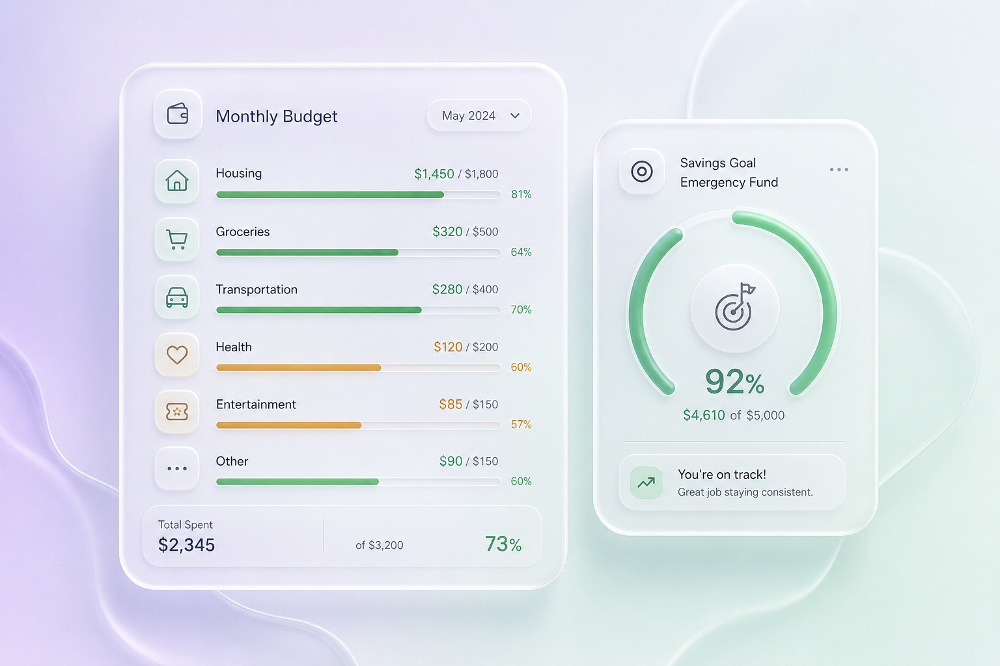
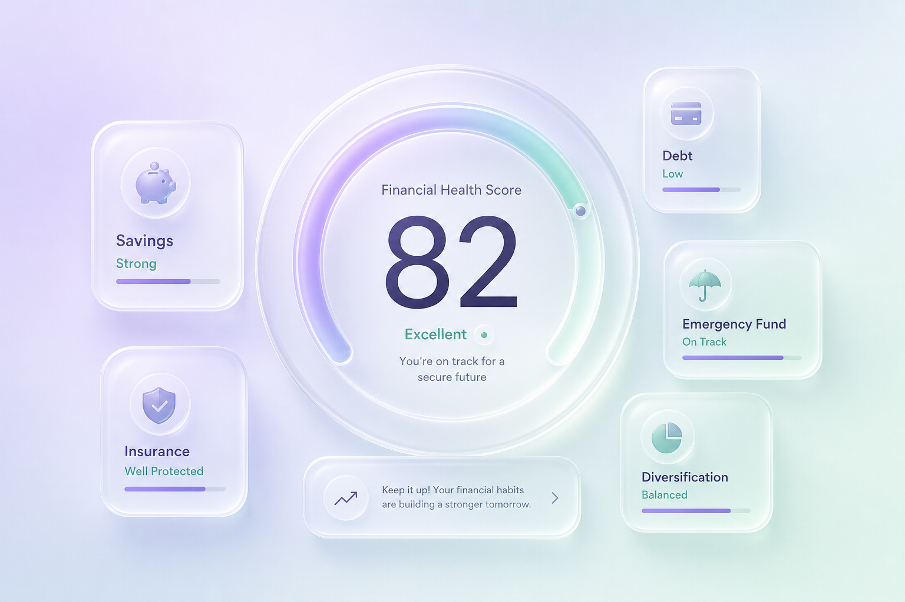
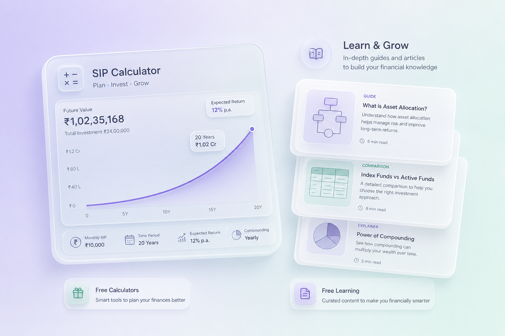

# FinBoom — Product & User Journey

> **Know your true wealth.** FinBoom is an offline-first personal finance & net worth tracker built for Indian investors, wrapped in an Apple-inspired liquid-glass interface.
>
> **Live:** https://finboom-cyan.vercel.app

This document walks through the product from a user's point of view — the story of someone going from "I have money scattered everywhere" to "I know exactly what I'm worth and what to do next." For the engineering/architecture view, see [`DOCUMENTATION.md`](./DOCUMENTATION.md).

> ℹ️ The images below are **representative illustrations** of each stage in the FinBoom design language (liquid glass, ₹ amounts, real chart types). They convey the experience; exact pixels in the live app may differ.

---

## What FinBoom does

Most Indians hold money across stocks, mutual funds, FDs, PPF/EPF, gold, real estate, crypto and cash — spread over a dozen apps and statements. FinBoom pulls all of it into **one private dashboard**, so you can see your **real net worth**, understand **where your money is**, plan **budgets and goals**, and get a **0–100 Wealth Check** that tells you what to fix next. It works **fully offline** as an installable app, and ships free **financial calculators** and a **finance blog** to bring people in.

---

## Who it's for

| Persona | Goal | What FinBoom gives them |
|---------|------|--------------------------|
| **The scattered investor** | "Where is all my money, really?" | One consolidated net worth across 22+ asset classes, with import from Zerodha/Groww |
| **The planner** | "Am I on track for my goals?" | Inflation-adjusted goals, monthly budgets, savings-rate insight |
| **The optimizer** | "What should I improve next?" | Wealth Check score with prioritized, personalized actions |
| **The family CFO** | "I manage money for my whole family" | Separate profiles for spouse, parents, kids, business — one combined view |
| **The learner / visitor** | "Help me make a smart money decision" | Free SIP/FD/tax calculators and a visual-first finance blog (no login) |

---

## The journey at a glance

The first four stages get a user to their **"aha" moment** (seeing true net worth). Stages 5–7 turn it into a **habit** — plan, improve, learn, repeat.

---

## 1 · Discover — "Know your true wealth"

- **What the user does:** Arrives at the landing page (or a Google search lands them on a `/tools` calculator or a blog post).
- **What they see:** A clear value proposition, a preview of the net-worth dashboard, and instant proof of usefulness via free calculators — no signup wall.
- **Why it matters:** The public surfaces (`/`, `/tools`, `/blog`) are SEO-optimized to pull in organic traffic and let people experience value *before* creating an account.

**Routes:** `/` · `/tools` · `/blog`

---

## 2 · Onboard — Sign up & guided tour

- **What the user does:** Signs in with Clerk (email or Google) and lands in the dashboard for the first time.
- **What they see:** A **12-step guided tour** that introduces every area — Dashboard, Assets, Liabilities, Transactions, Budget, Parties, Goals, Snapshots, Health, Profiles, Settings, Blog. On desktop it's a spotlight walkthrough; on mobile it's a native-style swipeable carousel.
- **Why it matters:** New users immediately understand the breadth of the app instead of facing an empty screen. The tour can be replayed any time from the sidebar.

**Routes:** `/login` → `/dashboard` (tour auto-starts on first visit)

---

## 3 · Build — Add & import your portfolio

- **What the user does:** Adds assets and liabilities — manually, or by **importing an Excel/CSV** export from Zerodha, Groww, or a generic sheet.
- **What they see:** 22+ asset classes (stocks, mutual funds, FD, PPF, EPF, NPS, SGB, gold, real estate, crypto, US stocks, and more), each with invested value, current value, units and gain/loss. Loans capture EMI, interest rate and tenure.
- **Why it matters:** This is the data foundation. Import removes the biggest barrier — typing everything in by hand — so users reach their net-worth number in minutes.

**Routes:** `/dashboard/assets` · `/dashboard/liabilities` · import via the Import modal

---

## 4 · Track — Your net worth, at a glance

- **What the user does:** Opens the dashboard regularly to check where they stand.
- **What they see:** **Net worth = assets − liabilities** in real time, a net-worth trend chart from monthly snapshots, an asset-allocation donut, goal progress, and **portfolio analytics** that flag over-concentration (e.g. one stock or one asset class dominating).
- **Why it matters:** This is the product's core "aha" — a single honest number, plus the context to understand it. Everything is shown in the user's chosen currency while stored safely in INR.

**Routes:** `/dashboard` · `/dashboard/assets` (analytics) · `/dashboard/snapshots`

---

## 5 · Plan — Budgets & goals

- **What the user does:** Sets monthly **budgets** per category and creates **goals** (retirement, home, emergency fund, etc.).
- **What they see:** Budget progress bars (green → amber → red) with auto-suggested limits based on the last 3 months and a "copy from last month" shortcut. Goals show **inflation-adjusted** targets and can be **linked to specific assets** so progress updates automatically.
- **Why it matters:** Tracking net worth tells you *where you are*; budgets and goals tell you *where you're going* and whether your monthly behavior supports it.

**Routes:** `/dashboard/budget` · `/dashboard/goals` · `/dashboard/transactions`

---

## 6 · Improve — Your Wealth Check score

- **What the user does:** Opens **Wealth Check** to get a single, honest grade on their finances.
- **What they see:** A **0–100 score** (Needs work → Fair → Good → Excellent) computed deterministically from *their own data* across **7 weighted dimensions** — asset allocation, emergency fund, insurance cover, tax efficiency (80C), debt load, savings rate, and goal progress. Each weak area comes with a concrete, prioritized action.
- **Why it matters:** It turns a pile of numbers into a clear "what to fix next," which is what keeps users coming back and improving over time.

**Routes:** `/dashboard/health`

---

## 7 · Learn & grow — Calculators & blog

- **What the user does:** Uses free calculators to make decisions and reads the blog to get smarter.
- **What they see:** A suite of **free public calculators** — SIP, Step-Up SIP, Lumpsum, FD, XIRR, HRA, and old-vs-new **Income Tax** — each with its own FAQ and SEO metadata. The **blog** delivers visual-first, AI-assisted articles that lead with key takeaways, Mermaid diagrams and comparison tables, with an RSS feed.
- **Why it matters:** This is both a **growth engine** (organic search → calculators/blog → signups) and a **retention loop** (logged-in users keep learning and planning).

**Routes:** `/tools` · `/tools/[slug]` · `/blog` · `/blog/[slug]` · `/feed.xml`

---

## Cross-cutting experience

These run through every stage of the journey:

| Capability | What the user gets |
|------------|--------------------|
| **Offline-first PWA** | Install FinBoom like a native app; view and edit everything offline — changes sync automatically when back online |
| **Privacy & security** | Per-user data isolation (Supabase Row Level Security), optional 4-digit **PIN lock**, and one-tap **data export** (JSON/CSV) |
| **Multi-currency** | Store in INR, display in 10 currencies with daily exchange rates; Indian Lakh/Crore notation |
| **Multiple profiles** | Separate finances for Personal, Spouse, Parent, Child or Business — with a combined net-worth view |
| **Smart reminders** | Push notifications for overdue/upcoming lent-or-borrowed money, goal milestones, and a weekly net-worth summary |
| **Considered details** | Hover/focus tooltips on icon-only controls, professional Lucide iconography, and a clear red style for destructive actions |

---

## Stage → app map (quick reference)

| Stage | Primary routes | Key features |
|-------|----------------|--------------|
| 1 · Discover | `/`, `/tools`, `/blog` | Value prop, free calculators, blog (SEO) |
| 2 · Onboard | `/login`, `/dashboard` | Clerk auth, 12-step guided tour |
| 3 · Build | `/dashboard/assets`, `/dashboard/liabilities` | 22+ asset classes, Excel/CSV import |
| 4 · Track | `/dashboard`, `/dashboard/snapshots` | Net worth, charts, portfolio analytics |
| 5 · Plan | `/dashboard/budget`, `/dashboard/goals` | Budgets, inflation-adjusted goals |
| 6 · Improve | `/dashboard/health` | Wealth Check 0–100 score + actions |
| 7 · Learn | `/tools/*`, `/blog/*`, `/feed.xml` | Calculators, visual-first blog, RSS |
| Everywhere | `/dashboard/profiles`, `/dashboard/settings` | Profiles, currency, PIN, export, offline |
